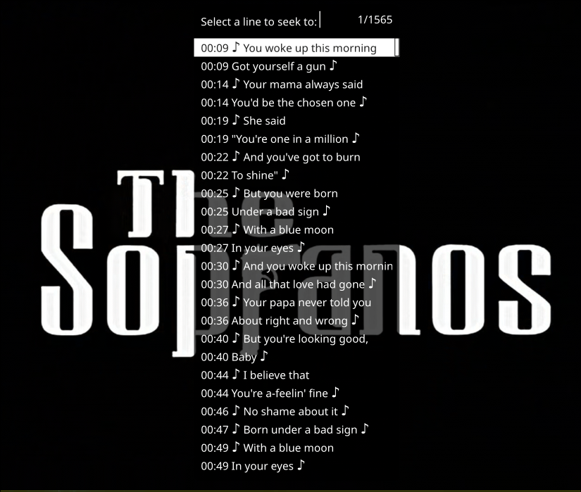
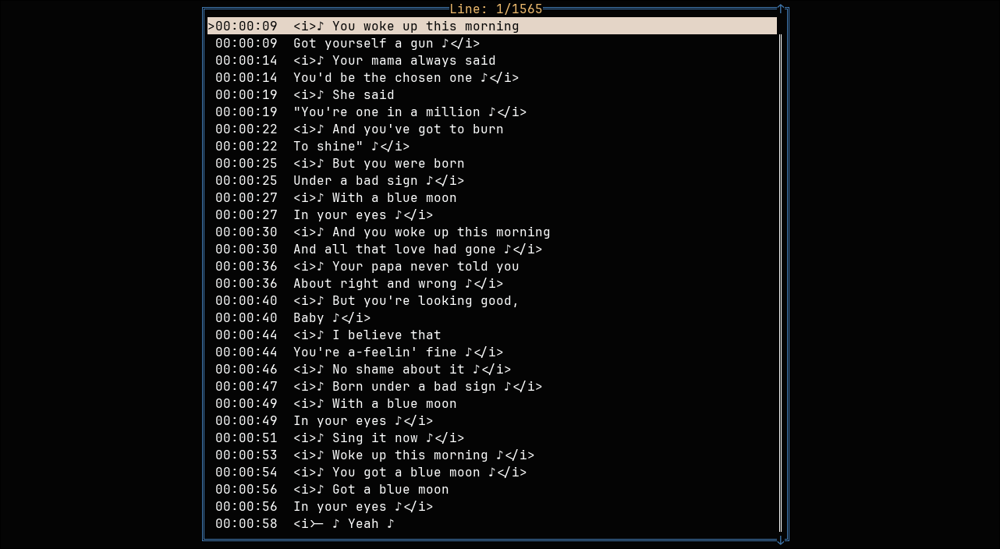

# `srt-linter` 💬🔍
<p align="center">


</p>

💬🔍 `srt-linter` is a CLI tool to inspect and detect issues inside [SubRip Text](https://en.wikipedia.org/wiki/SubRip) (`.srt`) files.

# ToC
- [Installation 📥](#installation-)
- [Usage ⌨️](#usage-)
- [Wishlist 💭](#wishlist-)
- [Contributing 🤝](#contributing-)
- [Acknowledgements ✨](#acknowledgements-)
- [License ⚖️](#license-)

## Installation 📥
### Cargo (building from scratch) 📦
Install `srt-linter` with `cargo`:
```
$ cargo install srt-linter
```

### Homebrew (macOS only) 🍺
Install `srt-linter` with `brew`:
```
$ brew install furtidev/pub/srt-linter
```

### Manual 💾
You can get the latest pre-built binary from [here.](https://github.com/furtidev/srt-linter/releases) You may need to give it executable permissions.

Note that on MacOS, you need to remove the `com.apple.quarantine` attribute from the binary:
```
$ xattr -d com.apple.quarantine ./srt-linter.darwin.aarch64
```

## Usage ⌨️
`srt-linter` has a very simple interface:
```bash
$ srt-linter --help
Look for issues inside SubRip text (.srt) files.

Usage: srt-linter [OPTIONS] <FILE_PATH>

Arguments:
  <FILE_PATH>

Options:
  -v, --verbose  Logs additional information about internal actions
  -s, --strict   Enforces stricter rules for suspicious behavior
  -t, --tui      Shows a TUI at the end
  -h, --help     Print help
  -V, --version  Print version
```

Consider this:
```bash
$ srt-linter -s -v ./the.sopranos.s6.ep4.srt
[INFO] Detected BOM.
[SUCCESS] File is semantically OK.
[SUCCESS] File is structurally OK. Read 1565 line(s).
```
`srt-linter` is saying the following things:
1. It detected the byte-order mark (`U+FEFF`) character on the file. (`-v/--verbose`)
2. It successfully went through the file and ensured each line is accurate as per the SubRip Text format.
3. It successfully parsed the file, ensuring structural soundness and read 1565 lines of subtitle text.

`srt-linter` says this file is valid. Let's load it up on a media player and see if `srt-linter` is right.

I'm using `mpv` and there you go:



A similar interface is available in `srt-linter`, just pass in the `-t/--tui` flag:



## Wishlist 💭
- [x] Implement a TUI to visualize the subtitles.
- [x] Implement `.srt` format's unofficial markup extension.

## Contributing 🤝
Hey, thanks! If you've found a bug or something that works unexpectedly, feel free to [open an issue](https://github.com/furtidev/srt-linter/issues/new). 

If you're a programmer and are interested in fixing it yourself, take a look at [CONTRIBUTING.md](./CONTRIBUTING.md). I really appreciate your help!

## Acknowledgements ✨
Thanks to [@hitblast](https://github.com/hitblast) for helping me test `srt-linter`.

## License ⚖️
This project is licensed under the [MIT license](./LICENSE).
